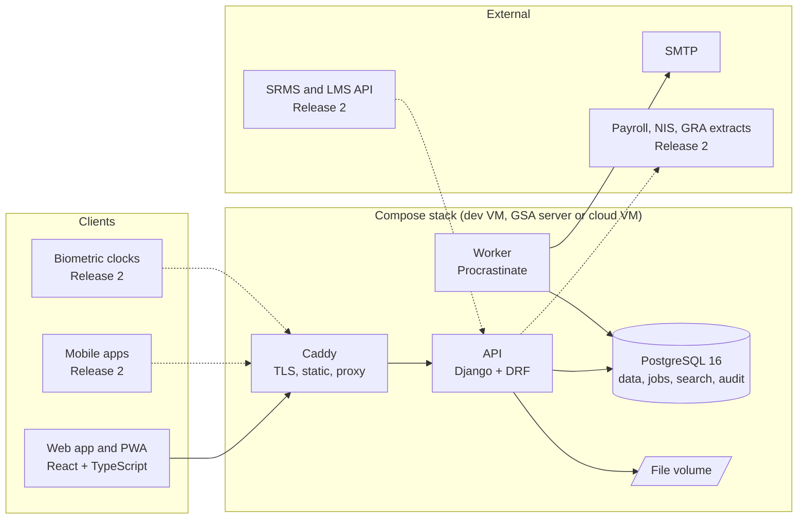

# Architecture

## System diagram

Solid lines are Release 1; dotted lines are Release 2.

## Layers

| Layer | Location | Responsibility |
|---|---|---|
| Presentation | `web/` | Screens from the wireframes; talks only to `/api/v1`; installable PWA with offline queue for leave requests |
| API | `api/` Django apps | Authentication, role and campus scoping, validation, business rules, OpenAPI schema |
| Workflow | `api/leave/workflow.py` (Release 1), generalised later | State machine for requests: states, transitions, approver resolution, side effects |
| Jobs | Procrastinate tasks in each app | Accruals, expiry alerts, notifications, report generation |
| Data | PostgreSQL via Django migrations | Schema from the Wireframes and Database Design draft; ledger-based balances; insert-only audit |
| Edge | `deploy/` | Caddy TLS, compression, security headers |

## Request flow: leave request (Release 1)

1. Employee submits from the PWA. Offline submissions are queued and replayed.
2. `POST /api/v1/leave/requests` validates dates, balance (sum of ledger rows) and overlaps, creates the request in state `submitted`, writes an audit row in the same transaction.
3. The workflow resolves the approval chain from the employee's position (supervisor, then campus HR Officer) and enqueues a notification job.
4. The worker sends email. Approvers act through `POST /api/v1/leave/requests/{id}/transition`.
5. Final approval debits the ledger. Balances are never stored as mutable numbers.

## Security

TLS at Caddy; session auth for the web app and short-lived tokens for installed clients; MFA (TOTP) for
Administrator, HR Manager and Finance roles; role scopes by campus and unit enforced in one permission layer;
NIS number, TIN and national ID encrypted at the application layer with `FIELD_ENCRYPTION_KEY` held only in
the server environment; insert-only `audit_log` table; OWASP checks in CI before go-live.
