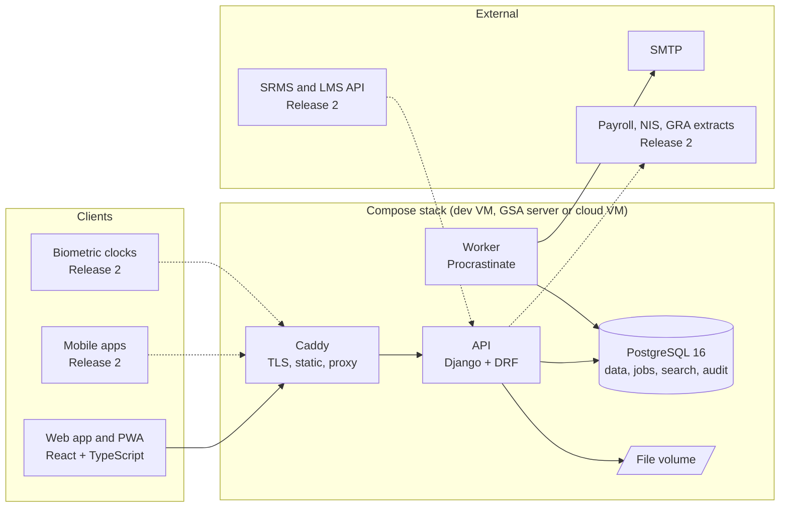

# Architecture

## System diagram

```mermaid
flowchart LR
  subgraph Clients
    W[Web app and PWA<br/>React + TypeScript]
    M[Mobile apps<br/>Release 2]
    B[Biometric clocks<br/>Release 2]
  end
  subgraph Server["Compose stack (dev VM, GSA server or cloud VM)"]
    C[Caddy<br/>TLS, static, proxy]
    A[API<br/>Django + DRF]
    J[Worker<br/>Procrastinate]
    P[(PostgreSQL 16<br/>data, jobs, search, audit)]
    F[/File volume/]
  end
  subgraph External
    E[SMTP]
    X[Payroll, NIS, GRA extracts<br/>Release 2]
    R[SRMS and LMS API<br/>Release 2]
  end
  W --> C --> A --> P
  M -.-> C
  B -.-> C
  A --> F
  J --> P
  J --> E
  A -.-> X
  R -.-> A
```

Solid lines are Release 1; dotted lines are Release 2.

## Layers

| Layer | Location | Responsibility |
|---|---|---|
| Presentation | `web/` | Screens from the wireframes; talks only to `/api/v1`; installable PWA with offline queue for leave requests |
| API | `api/` Django apps | Authentication, role and campus scoping, validation, business rules, OpenAPI schema |
| Workflow | `api/leave/workflow.py` (Release 1), generalised later | State machine for requests: states, transitions, approver resolution, side effects |
| Jobs | Procrastinate tasks in each app | Accruals, expiry alerts, notifications, report generation |
| Data | PostgreSQL via Django migrations | Schema from the Wireframes and Database Design draft; ledger-based balances; insert-only audit |
| Edge | `deploy/` | Caddy TLS, compression, security headers |

## Request flow: leave request (Release 1)

1. Employee fills the form in the PWA. `POST /api/v1/leave/requests/check` answers as they type: days,
   balance left, whether evidence is needed, anything that blocks the request. Offline submissions are
   queued and replayed; one that needs evidence is kept as a draft until the file is attached.
2. `POST /api/v1/leave/requests` validates dates, balance, overlaps and eligibility and creates a draft;
   `POST .../{id}/evidence` attaches the doctor's note or other evidence; an audit row is written in the
   same transaction.
3. `POST .../{id}/transition` with `submit` checks the rules again, sends the request to the employee's
   manager (head of their unit, or the nearest head above) and notifies them.
4. The manager approves; Human Resources gives the final approval. Nobody decides their own request.
5. Final approval debits the ledger, issues the receipt and notifies the employee with the days left.
   Balances are never stored as mutable numbers.

## Security

TLS at Caddy; session auth for the web app and short-lived tokens for installed clients; MFA (TOTP) for
Administrator, HR Manager and Finance roles; role scopes by campus and unit enforced in one permission layer;
NIS number, TIN and national ID encrypted at the application layer with `FIELD_ENCRYPTION_KEY` held only in
the server environment; insert-only `audit_log` table; OWASP checks in CI before go-live.
