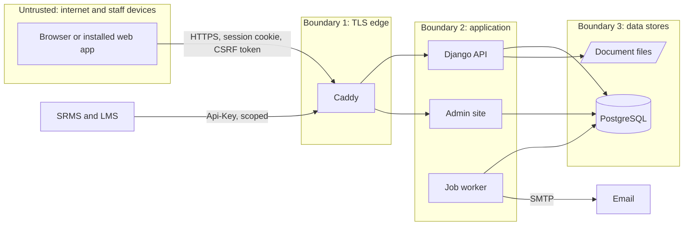

# Threat model

**Version 1.1, 1 October 2026.** Method: STRIDE over the data flows in section 3, against the code on
branch `feature/phase-1-security-hardening`. Version 1.1 records the four gaps closed by pull request 16
(items 1.28, 1.35, 1.36, 1.37) and one weakness found while closing them (forged addresses). Reviewed at every release gate and whenever a data flow, role or
integration is added. Gaps point to items in the Gold Standard Plan checklist.

## 1. What is protected

| Asset | Examples | Classification | Where it lives and how |
|---|---|---|---|
| National identifiers | National ID, NIS number, TIN | Personal; identity fraud if leaked. The Data Protection Act 2023 allows extra safeguards for national ID numbers by regulation | Encrypted columns (Fernet, key from `FIELD_ENCRYPTION_KEY`); masked in every list |
| Health records | Doctor's notes, medical documents | Sensitive personal data (health record) | File volume, classified "medical"; the employee and HR only |
| Financial records | Hourly rate, grade amount; later pay and bank details | Sensitive personal data (financial record) | Contract terms; pay fields blanked for roles without need |
| Employment records | Appointments, contracts, leave, decisions, receipts | Personal | PostgreSQL |
| Contact data | Phone, address, next of kin | Personal | PostgreSQL |
| Audit log | Who did what, when, from where, before and after | Integrity-critical | Insert-only table; a database trigger refuses UPDATE and DELETE |
| Credentials | Passwords, TOTP secrets, service keys, session cookies | Secret | PBKDF2-SHA256 with 1,000,000 iterations; TOTP secrets encrypted; service keys stored as SHA-256 hashes |
| Server secrets | `DJANGO_SECRET_KEY`, `FIELD_ENCRYPTION_KEY`, database and SMTP passwords | Secret | Environment only (git-ignored `.env`, platform variables) |
| Backups | Database dumps, copies of the file volume | As their content | Not built yet (item 7.09) |

## 2. Who uses it, and who might attack it

| Actor | Access |
|---|---|
| Employee | Own record, own leave, often on a phone over mobile data |
| Supervisor | Decisions on their own team's leave |
| HR officer | Campus-scoped writes, reveal of identifiers, medical evidence for leave |
| HR manager, Finance, Administrator | Broad access; authenticator code required |
| Principal, Auditor, Ministry liaison | Broad read |
| SRMS and LMS | Service keys with scopes `staff:read`, `org:read`, `training:write` |
| Operators | Shell and database access on the host (Railway now, GSA's server later) |

Threat sources: an attacker on the internet; a current or former member of staff misusing access; a lost
or shared phone; a compromised dependency; a compromised sibling system.

## 3. Data flows and trust boundaries

## 4. Threats and controls

### Spoofing

| Threat | In place | Gap |
|---|---|---|
| Password guessing at sign-in | Lockout after 5 failures in 15 minutes per account; **one address that fails 20 times in 15 minutes, across any accounts, waits out the window** (pull request 16); 12-character minimum and common-password check; authenticator code for administrators, HR managers, Finance and superusers | HR officers can reveal identifiers and open doctor's notes without an authenticator code (item 1.34) |
| The admin site as a side door | **Fixed in pull request 15:** the admin has no password form of its own and accepts only a web sign-in that has passed the authenticator step | |
| Stolen session cookie | HttpOnly; Secure in production; SameSite Lax; HSTS for one year; **a session ends after 30 minutes idle or 8 hours in all; people see every device they are signed in on and can end any of them, or all but the current one** (pull request 16) | |
| Stolen service key | Hashed at rest, scoped, rotatable, last use recorded, every call audited; sibling calls use the private network | Rotation is not scheduled; record it in the runbook (item 7.11) |
| Shared phone or kiosk | Sign-out on every screen; initials of the signed-in person shown on phones; 30-minute idle time-out | |

### Tampering

| Threat | In place | Gap |
|---|---|---|
| Changing records without trace | Every write goes through audited views in the same transaction | A database superuser can disable the trigger; chain the audit rows by hash so that tampering shows (item 1.26) |
| Cross-site request forgery | Django CSRF protection on every session write | |
| Harmful uploads | **Every upload is checked by its contents, not its name** (PDF, photographs, and Word or Excel without macros), with limits of 10 MB for evidence and 20 MB for documents; **Caddy refuses any request over 25 MB**; **files are stored under random names** and downloaded under the name chosen; every download is an attachment with `nosniff`, never a public URL (pull request 16) | |
| Tampered dependencies | Python packages locked with hashes; npm lockfile; CI actions pinned to commits; licence, vulnerability and secret gates | Base images follow tags (ADR 0009); software bill of materials per release (item 7.17) |

### Repudiation

| Threat | In place | Gap |
|---|---|---|
| Denying an approval or a change | Audit rows with actor, time, address, before and after; leave decisions stored with the decider's name | Keep audit rows at least 7 years (item 1.32); synchronise the production clock (item 7.11) |
| Forging the address recorded in the audit log | **Fixed in pull request 16:** the address came from the left-most `X-Forwarded-For` entry, which the client writes. Caddy now sets `X-Real-IP` to the address it saw (strict trusted-proxy parsing behind the hosting platform's edge) and only that is recorded | Sibling systems on the private network reach the API without Caddy; their calls are recorded against their service key |

### Information disclosure

| Threat | In place | Gap |
|---|---|---|
| Identifiers in lists, logs or the integration API | Encrypted at rest, masked in responses and audit snapshots, full values only through the audited reveal for HR roles, never in the integration API | Rotating the field key is a manual procedure; keep the key and the backups apart (item 7.09) |
| Doctor's notes seen by the wrong person | Medical class; the employee and HR only; downloads audited | Authenticator code for HR officers (item 1.34) |
| Pay seen by the wrong person | Pay fields blanked for roles without need | Bank details, when added, encrypted with a second person's approval (item 1.07) |
| Script injection stealing data | React escapes output; no user HTML is rendered; `X-Content-Type-Options`, `X-Frame-Options: DENY`, `Referrer-Policy`; **a Content-Security-Policy that allows only the app's own scripts, styles and data, checked on every screen of every browser journey**; **the API documentation is for signed-in people only outside development** (pull request 16) | The development server runs without the policy (hot reload needs inline scripts) |
| Real data on staging abroad | Staging holds fictional data only; `seed_demo` refuses to run without `--fictional` and marks every record | Production hosting in Guyana (item 7.04) |
| Data in backups | | Encrypted backups with an off-site copy (item 7.09) |
| Error details | Debug is off in production; `check --deploy` must pass in CI | |
| Personal details in email | | Email notices should carry a link, not names and dates, in case GSA's mail service is outside Guyana (item 2.26) |

### Denial of service

| Threat | In place | Gap |
|---|---|---|
| Flooding the API | Request rate limit; several gunicorn workers behind Caddy | Load test at twice the expected peak (item 7.08) |
| Filling the disk with uploads | 25 MB request cap at Caddy; 10 and 20 MB per file | Disk-space alerts (item 7.10) |

### Elevation of privilege

| Threat | In place | Gap |
|---|---|---|
| Reading another campus's or person's records | One permission layer for every endpoint; campus scoping in every viewset; scoping fails closed for callers who are not people (pull request 15); a test covers the whole permission table | Each new endpoint must join that test (definition of done) |
| Approving one's own request | The leave workflow refuses self-approval and sends requests to the employee's own manager | Carry the rule into the approvals engine (item 1.33) |
| Privileged access without a second factor | Enforced in the permission layer, and now in the admin | HR officers (item 1.34) |

## 5. Gaps added to the checklist by this review

| Item | Gap |
|---|---|
| 1.34 | Authenticator code for every role that can see identifiers or doctor's notes, HR officers included (waits for decision D10) |
| 1.35 | Upload controls for every file (closed in pull request 16) |
| 1.36 | Content-Security-Policy; API documentation for signed-in people (closed in pull request 16) |
| 1.37 | Sign-in limit by source address (closed in pull request 16) |
| 7.17 | Software bill of materials and third-party notices with each release |

## 6. Next review

At Gate 1 (30 October 2026) and when Phase 1 is complete. Owner: the Technical Lead, with GSA's IT Officer.
