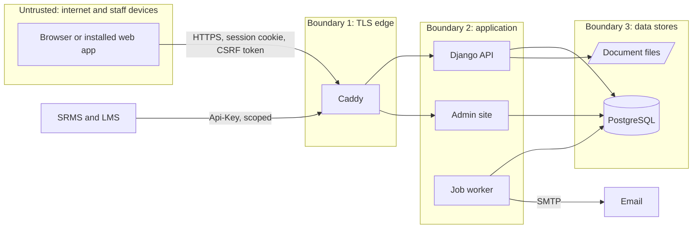

# Threat model

**Version 1.10, 1 October 2026.** Method: STRIDE over the data flows in section 3, against the code on
branch `feature/phase-1-careers`. Version 1.1 records the four gaps closed by pull request 16
(items 1.28, 1.35, 1.36, 1.37) and one weakness found while closing them (forged addresses). Version 1.2
records two weaknesses found while building the staff record (pull request 17): writes across campuses,
and a leave balance disclosed in a refusal. Version 1.3 records accounts and access (pull request 18:
invitations, password links, roles, switching off, the access review) and three weaknesses found while
building them: a new role that skipped its authenticator code, accounts linked to staff records through the
employee form, and a report that named staff on every campus. Version 1.4 records the audit log's chained
fingerprints and viewer (pull request 19, item 1.26), which close the gap of a database superuser changing
the log unseen. Version 1.5 records a person's own copy of their record and correction requests (pull request
20, item 1.31). Version 1.6 records the retention schedule, reviewed disposal and the breach register (pull
request 21, item 1.32). Version 1.7 records a pay disclosure in the organisation API, fixed in pull request 23, together with post
holders named on campuses the reader does not work with. Version 1.8 records the organisation chart (pull
request 24, item 1.10), which names people by the staff directory's rule. Version 1.9 records letters (pull request 25, item 1.19), and confidential documents that
supervisors and Finance could read, fixed there. Version 1.10 records career changes (pull request 26, item
1.11).
Reviewed at every release gate and whenever a data flow, role or integration is added. Gaps
point to items in the Gold Standard Plan checklist.

## 1. What is protected

| Asset | Examples | Classification | Where it lives and how |
|---|---|---|---|
| National identifiers | National ID, NIS number, TIN | Personal; identity fraud if leaked. The Data Protection Act 2023 allows extra safeguards for national ID numbers by regulation | Encrypted columns (Fernet, key from `FIELD_ENCRYPTION_KEY`); masked in every list |
| Health records | Doctor's notes, medical documents | Sensitive personal data (health record) | File volume, classified "medical"; the employee and HR only |
| Financial records | Hourly rate, grade amount; later pay and bank details | Sensitive personal data (financial record) | Contract terms; pay fields blanked for roles without need |
| Employment records | Appointments, contracts, leave, decisions, receipts | Personal | PostgreSQL |
| Contact data | Phone, address, next of kin | Personal | PostgreSQL |
| Audit log | Who did what, when, from where, before and after | Integrity-critical | Insert-only table; a database trigger refuses UPDATE and DELETE; every entry chained to the one before by a keyed fingerprint, checked every night |
| Credentials | Passwords, TOTP secrets, service keys, session cookies, password links | Secret | PBKDF2-SHA256 with 1,000,000 iterations; TOTP secrets encrypted; service keys stored as SHA-256 hashes; password links signed over the password and the last sign-in, so each works once, for 7 days (invitation) or 60 minutes (reset) |
| Server secrets | `DJANGO_SECRET_KEY`, `FIELD_ENCRYPTION_KEY`, database and SMTP passwords | Secret | Environment only (git-ignored `.env`, platform variables) |
| Backups | Database dumps, copies of the file volume | As their content | Not built yet (item 7.09) |

## 2. Who uses it, and who might attack it

| Actor | Access |
|---|---|
| Employee | Own record, own leave, often on a phone over mobile data |
| Supervisor | Decisions on their own team's leave |
| HR officer | Campus-scoped writes, reveal of identifiers, medical evidence for leave; opens staff accounts on their campus and gives the employee and supervisor roles there |
| HR manager, Finance, Administrator | Broad access; authenticator code required. The HR Manager also appoints HR officers; only an administrator gives the roles that see every campus, handle money, audit, answer to the Ministry or administer |
| Principal, Auditor, Ministry liaison | Broad read |
| SRMS and LMS | Service keys with scopes `staff:read`, `org:read`, `training:write` |
| Operators | Shell and database access on the host (Railway now, GSA's server later) |

Threat sources: an attacker on the internet; a current or former member of staff misusing access; a lost
or shared phone; a compromised dependency; a compromised sibling system.

## 3. Data flows and trust boundaries

Letters (item 1.19) are rendered inside the API by the PDF engine, from escaped text only, and the engine
is given a fetcher that refuses every address: it reaches nothing outside the process. The PDF is filed
with the other document files.

## 4. Threats and controls

### Spoofing

| Threat | In place | Gap |
|---|---|---|
| Password guessing at sign-in | Lockout after 5 failures in 15 minutes per account; **one address that fails 20 times in 15 minutes, across any accounts, waits out the window** (pull request 16); 12-character minimum and common-password check; authenticator code for administrators, HR managers, Finance and superusers | HR officers can reveal identifiers and open doctor's notes without an authenticator code (item 1.34) |
| The admin site as a side door | **Fixed in pull request 15:** the admin has no password form of its own and accepts only a web sign-in that has passed the authenticator step | |
| Stolen session cookie | HttpOnly; Secure in production; SameSite Lax; HSTS for one year; **a session ends after 30 minutes idle or 8 hours in all; people see every device they are signed in on and can end any of them, or all but the current one** (pull request 16) | |
| Stolen service key | Hashed at rest, scoped, rotatable, last use recorded, every call audited; sibling calls use the private network | Rotation is not scheduled; record it in the runbook (item 7.11) |
| Shared phone or kiosk | Sign-out on every screen; initials of the signed-in person shown on phones; 30-minute idle time-out | |
| HR choosing or knowing someone's password | **Nobody sets another person's password** (pull request 18): an account opens with no usable password, and its holder chooses one from an emailed invitation that works once, for 7 days. The username is in the email; the password never is | Staff with no email address cannot receive an invitation: a one-use set-up code given in person, or sent by text message (item 1.41) |
| Taking over an account through "forgot password" | The answer is the same whether or not an account exists; the link goes only to the address on the account, works once and for 60 minutes; one network address may ask 5 times and one account is sent 3 links in 15 minutes; choosing a password ends every session the account had (pull request 18) | Sending the email takes a moment, so the response time hints whether one went out; acceptable within these limits, and gone once mail is sent by the job worker |
| Redirecting the links | An account's email follows the staff record only until its invitation is used, so a mistyped address can be mended; after that it changes only in the database | An audited change of the sign-in address, with a notice to the old address (item 1.42) |

### Tampering

| Threat | In place | Gap |
|---|---|---|
| Moving someone, or changing their pay, without a trace | **Transfers, promotions, increments, acting appointments and confirmations change appointments only as recorded events with a reason** (pull request 26): each is checked against the file as it will stand on its date, audited when recorded and when it takes effect, and one dated later is applied by the nightly task, which records itself as the system and leaves nothing half done when a change can no longer happen | First appointments are still added directly, until recruitment and onboarding (Phase 3) open them through their own events |
| Changing records without trace | Every write goes through audited views in the same transaction | |
| A forged or altered letter | Every letter has a reference, and its record keeps the template version, the values that went in and the SHA-256 fingerprint of the PDF as issued; HR confirms a letter by its reference and can compare the fingerprint (pull request 25) | A way for a bank, embassy or employer to check a letter by its reference without signing in (item 1.47) |
| Destroying records to hide something | Records are destroyed only under the retention schedule, in a run that one person lists and a **second person approves**; anything can be kept back with a reason; a record no longer due when the run is approved is left; each destruction is in the audit log with its rule and what the record was (pull request 21) | |
| Changing or removing audit entries with the trigger switched off | **Closed in pull request 19 (item 1.26):** every entry carries an HMAC-SHA256 of the entry before it and of its own content, under a key derived from the server's field-encryption key, which is never in the database. Entries are written one at a time under a lock, so the chain follows commit order. A check walks the chain every night, and on request in the audit viewer; a changed or removed entry shows at the first entry that no longer fits, and entries removed from the end show at the next check because each check keeps the newest entry it saw. A broken chain alerts the administrators and the auditor at once, and every result is written to the platform log, outside the database | Someone holding both the database and the server's key could rewrite the chain: keep the key apart from the database and its backups (item 7.09). Entries removed from the end after the last check show only at the next one |
| Cross-site request forgery | Django CSRF protection on every session write | |
| Harmful uploads | **Every upload is checked by its contents, not its name** (PDF, photographs, and Word or Excel without macros), with limits of 10 MB for evidence and 20 MB for documents; **Caddy refuses any request over 25 MB**; **files are stored under random names** and downloaded under the name chosen; every download is an attachment with `nosniff`, never a public URL (pull request 16) | |
| Tampered dependencies | Python packages locked with hashes; npm lockfile; CI actions pinned to commits; licence, vulnerability and secret gates | Base images follow tags (ADR 0009); software bill of materials per release (item 7.17) |

### Repudiation

| Threat | In place | Gap |
|---|---|---|
| Denying an approval or a change | Audit rows with actor, time, address, before and after; leave decisions stored with the decider's name; **opening, switching off and on, roles given and taken (with the roles before and after), links sent and authenticators reset are audited, most with a reason, and appear in the person's history** (pull request 18); **the auditor and administrators read every entry in words, filter it and export it; the export and each check of the chain are recorded too** (pull request 19) | Keep audit rows at least 7 years (item 1.32); synchronise the production clock (item 7.11) |
| Forging the address recorded in the audit log | **Fixed in pull request 16:** the address came from the left-most `X-Forwarded-For` entry, which the client writes. Caddy now sets `X-Real-IP` to the address it saw (strict trusted-proxy parsing behind the hosting platform's edge) and only that is recorded | Sibling systems on the private network reach the API without Caddy; their calls are recorded against their service key |

### Information disclosure

| Threat | In place | Gap |
|---|---|---|
| Identifiers in lists, logs or the integration API | Encrypted at rest, masked in responses and audit snapshots, full values only through the audited reveal for HR roles, never in the integration API | Rotating the field key is a manual procedure; keep the key and the backups apart (item 7.09) |
| Confidential documents seen by supervisors or Finance | **Fixed in pull request 25:** only medical documents were held back, so supervisors and Finance could list and download confidential ones: contract scans that show pay, and leave evidence that the leave screens keep to the employee and HR. Confidential documents, and the register of letters, are now for HR, the Principal and the auditor; a contract or identity document cannot be filed below Confidential, nor a medical paper below Medical | |
| A letter made to reach a server | Letters are built from escaped text only, so wording and values can add no markup, and the PDF engine is given a fetcher that refuses every address: no image, style sheet or page is fetched (pull request 25) | |
| Doctor's notes seen by the wrong person | Medical class; the employee and HR only; downloads audited | Authenticator code for HR officers (item 1.34) |
| Pay seen by the wrong person | **Fixed in pull request 23:** the amounts of the salary scale were readable by anyone signed in, so pay could be worked out from a colleague's post and grade. Amounts now show only to the roles that see pay elsewhere (`Role.SEES_PAY`), and who holds a post or heads a unit only to the roles that read the staff directory, on the campuses the directory shows them; the organisation chart (pull request 24) names people by the same rule and never shows an amount. Pay fields blanked for roles without need; **bank details encrypted, shown by their last four digits, revealed only to those who decide and always audited; a change takes effect only when a second person approves it, and the employee is told** (pull request 17) | |
| A refusal describing someone on another campus | **Fixed in pull request 17:** asking for leave for an employee on another campus was refused with that employee's leave balance in the message. Fields that name an employee, appointment, contract, document or post now accept only records in the caller's scope, before any other check, so an id on another campus reads as unknown | |
| A report naming staff on every campus | **Fixed in pull request 17 (found while building pull request 18):** a campus HR officer could run the staff-records-to-check report for every campus, because the report took its campus from the address and, given none, ran over all of them. Reports whose rows name people now run only over the campuses the person works with, and asking for another is refused | |
| Script injection stealing data | React escapes output; no user HTML is rendered; `X-Content-Type-Options`, `X-Frame-Options: DENY`, `Referrer-Policy`; **a Content-Security-Policy that allows only the app's own scripts, styles and data, checked on every screen of every browser journey**; **the API documentation is for signed-in people only outside development** (pull request 16) | The development server runs without the policy (hot reload needs inline scripts) |
| Real data on staging abroad | Staging holds fictional data only; `seed_demo` refuses to run without `--fictional` and marks every record | Production hosting in Guyana (item 7.04) |
| Data in backups | | Encrypted backups with an off-site copy (item 7.09); destroyed records stay in backups until those expire, so the backup period belongs in the schedule too |
| A breach going unrecorded or unanswered | **A breach register: what, whose data, how many people, the risk, when contained, when the Commissioner and the people were told; recording one alerts the administrators** (pull request 21) | Write the breach response procedure into the runbook (item 7.11) |
| Error details | Debug is off in production; `check --deploy` must pass in CI | |
| Personal details in email | | Email notices should carry a link, not names and dates, in case GSA's mail service is outside Guyana (item 2.26) |
| A person's own record leaking once downloaded | **The file a person downloads under My record leaves out full bank account numbers (the last four digits identify the account); every viewing, and every copy HR produces for a paper request, is recorded** (pull request 20). The person's own identity numbers are in it, as the right of access requires | Tell staff, in the privacy notice, to keep the file safe |
| Changing someone's record through a "correction" | A correction request changes nothing by itself: HR makes the change on the staff record, where it needs a reason and is audited. HR cannot answer a request about themselves, and only answers for staff on their campus (pull request 20) | |
| A spreadsheet export that runs formulas | **The audit export prefixes any cell that a spreadsheet would run as a formula** (`=`, `+`, `-`, `@`), so text typed into a reason cannot run when the file is opened (pull request 19) | Apply the same rule to every export as reports gain Excel output (item 6.02) |

### Denial of service

| Threat | In place | Gap |
|---|---|---|
| Flooding the API | Request rate limit; several gunicorn workers behind Caddy | Load test at twice the expected peak (item 7.08) |
| Filling the disk with uploads | 25 MB request cap at Caddy; 10 and 20 MB per file | Disk-space alerts (item 7.10) |

### Elevation of privilege

| Threat | In place | Gap |
|---|---|---|
| Reading another campus's or person's records | One permission layer for every endpoint; campus scoping in every viewset; scoping fails closed for callers who are not people (pull request 15); a test covers the whole permission table | Each new endpoint must join that test (definition of done) |
| Moving staff onto another campus's post | A change names its post through the same campus check as every other write: an HR officer can move someone only to a post on a campus they work with, and only for staff on such a campus (pull request 26) | |
| Writing records for another campus | **Fixed in pull request 17:** a campus-scoped HR officer could create an employee, appointment, contract, document, leave request or entitlement for staff on another campus, because scope was checked on reading and editing but not on creating. Every write now checks it, in the field and again in the view, and a test tries each path | |
| Approving one's own request | The leave workflow refuses self-approval and sends requests to the employee's own manager | Carry the rule into the approvals engine (item 1.33) |
| Privileged access without a second factor | Enforced in the permission layer, and now in the admin | HR officers (item 1.34) |
| A new role used without its second factor | **Fixed in pull request 18:** a session was marked verified at sign-in when its roles needed no authenticator code. A role that needs one, given later (in the admin site, for example), then worked in that session without a code. A session now counts as verified only after a code, and giving or taking a role through the accounts screen signs the person out everywhere | |
| Acting as someone else in self-service | **Fixed in pull request 18:** the employee form accepted an account id, so any HR officer could link an account (their own, for example) to a member of staff, then ask for leave or decide it as that person. The link is now read-only, set only when HR opens an account for that person | |
| Giving oneself, or others, more access | Who gives which role is fixed: HR officers give the employee and supervisor roles on their own campus, the HR Manager HR officers too, an administrator everything. Only someone who could give every role an account holds may change that account, and nobody changes their own, so an administrator always remains. **The access review lists every role of every account, with who gave it and when, accounts unused for 90 days and missing authenticators; HR signs it off every three months and is reminded when it is due** (pull request 18) | |
| A leaver keeping access | Switching an account off ends every session at once and is audited with its reason (pull request 18) | Leaving (item 1.13) should switch the account off on the last day by itself |

## 5. Gaps added to the checklist by this review

| Item | Gap |
|---|---|
| 1.34 | Authenticator code for every role that can see identifiers or doctor's notes, HR officers included (waits for decision D10) |
| 1.35 | Upload controls for every file (closed in pull request 16) |
| 1.36 | Content-Security-Policy; API documentation for signed-in people (closed in pull request 16) |
| 1.37 | Sign-in limit by source address (closed in pull request 16) |
| 1.26 | Chained fingerprints over the audit log, a nightly check and an audit viewer (closed in pull request 19) |
| 1.41 | A first sign-in for staff with no email address: a one-use set-up code in person or by text message |
| 1.42 | The sign-in email address changed through an audited step that tells the old address |
| 1.47 | A way for a bank, embassy or employer to check a letter by its reference, without signing in |
| 7.17 | Software bill of materials and third-party notices with each release |

## 6. Next review

At Gate 1 (30 October 2026) and when Phase 1 is complete. Owner: the Technical Lead, with GSA's IT Officer.
